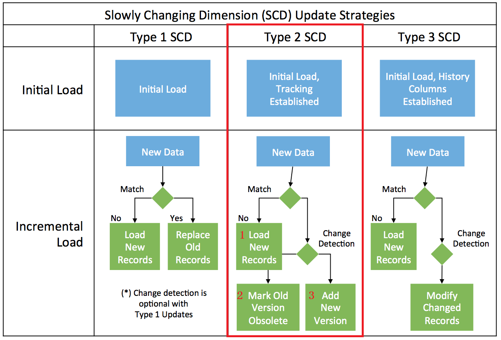

# Managing Slowly Changing Dimensions Type2 (SCD2) with Apache Hive 1.1(w/o UPDATE operation) and HBase 1.2 

This project is forked from cartershanklin/hive-scd-examples, which provides sample datasets and scripts. 
This project is mainly focused on Apache 1.1, and demonstrates how to manage Slowly Changing Dimensions Type2 (SCD2) without Apache Hive's MERGE or UPDATE capability.

## Procedure

## Requirements

* [Apache Hive](https://hive.apache.org/) 1.1 or later
* [Apache HBase](https://hbase.apache.org/) 1.2 or later

## Instructions

* Clone this repository onto your Hadoop cluster
* Run load_data.sh to stage data into HDFS
* From Hive CLI or beeline, run `hive_hbase_scd2.sql`
